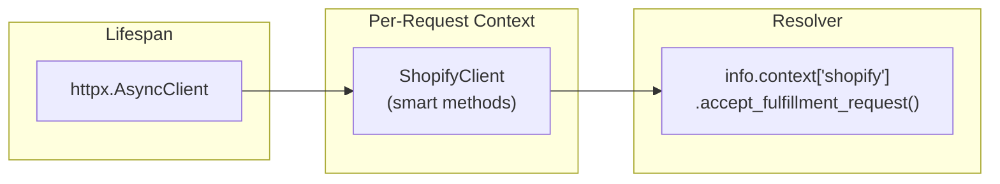
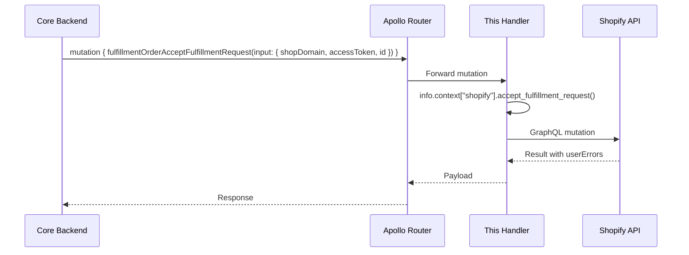

# Clean Ariadne Context Implementation

## Overview

Following [Ariadne's DataLoaders pattern](https://ariadnegraphql.org/server/dataloaders#initializing-loader-in-context), resolvers are thin and delegate to smart clients accessed via `info.context`.

## Architecture




## Data Flow



**Key:** Core backend passes `accessToken` - no extra round trip needed.

## File Changes

### 1. [app/graphql/inputs/fulfillment_order.py](app/graphql/inputs/fulfillment_order.py)

Add `accessToken` field:

```python
class FulfillmentOrderAcceptFulfillmentRequestInput(InputType):
    __schema__ = gql("""
        input FulfillmentOrderAcceptFulfillmentRequestInput {
            shopDomain: String!
            accessToken: String!
            id: ID!
            message: String
        }
    """)
    __args__ = convert_case
```


### 2. [app/context.py](app/context.py) - NEW

Smart client with specific methods (queries encapsulated inside):

```python
from __future__ import annotations
import httpx
from app.config import settings


class ShopifyClient:
    """Shopify Admin GraphQL API client with smart methods."""
    __slots__ = ("_http",)
    
    def __init__(self, http: httpx.AsyncClient):
        self._http = http
    
    async def accept_fulfillment_request(
        self, shop: str, token: str, id: str, message: str | None = None
    ) -> dict:
        """Accept a fulfillment request. Returns the mutation result."""
        query = """
        mutation($id: ID!, $message: String) {
          fulfillmentOrderAcceptFulfillmentRequest(id: $id, message: $message) {
            fulfillmentOrder { id status requestStatus }
            userErrors { field message }
          }
        }
        """
        data = await self._execute(shop, token, query, {"id": id, "message": message})
        return data["fulfillmentOrderAcceptFulfillmentRequest"]
    
    async def get_fulfillment_order(self, shop: str, token: str, id: str) -> dict | None:
        """Fetch a fulfillment order by ID."""
        query = """
        query($id: ID!) {
          fulfillmentOrder(id: $id) {
            id status requestStatus
            destination { address1 city countryCode zip firstName lastName }
            lineItems(first: 50) {
              edges { node { id remainingQuantity totalQuantity } }
            }
          }
        }
        """
        data = await self._execute(shop, token, query, {"id": id})
        return data.get("fulfillmentOrder")
    
    async def _execute(self, shop: str, token: str, query: str, variables: dict) -> dict:
        """Execute GraphQL against Shopify Admin API."""
        r = await self._http.post(
            f"https://{shop}/admin/api/{settings.shopify_api_version}/graphql.json",
            headers={"X-Shopify-Access-Token": token},
            json={"query": query, "variables": variables},
        )
        r.raise_for_status()
        return r.json()["data"]


def get_context_value(http_client: httpx.AsyncClient):
    """Factory that creates context_value function for Ariadne."""
    def context_value(request):
        return {
            "request": request,
            "shopify": ShopifyClient(http_client),
        }
    return context_value
```


### 3. [app/graphql/mutations/fulfillment_order.py](app/graphql/mutations/fulfillment_order.py)

Thin resolver - just one method call:

```python
@staticmethod
async def resolve_mutation(_, info, input: dict):
    try:
        result = await info.context["shopify"].accept_fulfillment_request(
            shop=input["shop_domain"],
            token=input["access_token"],
            id=input["id"],
            message=input.get("message"),
        )
        user_errors = result.get("userErrors", [])
        if user_errors:
            return {"success": False, "error": user_errors[0]["message"]}
        return {"success": True, "error": None}
    except Exception as e:
        return {"success": False, "error": str(e)}
```


### 4. [app/lifespan.py](app/lifespan.py)

Add HTTP client to app.state:

```python
@asynccontextmanager
async def pubsub_lifespan(app: Litestar):
    # Initialize shared HTTP client
    app.state.http_client = httpx.AsyncClient(timeout=30.0)
    
    # ... existing Pub/Sub setup unchanged ...
    
    try:
        yield
    finally:
        # ... existing Pub/Sub cleanup ...
        await app.state.http_client.aclose()
```


### 5. [main.py](main.py)

Wire context factory:

```python
from app.context import get_context_value

graphql_app: GraphQL | None = None

@asgi(path="/graphql", is_mount=True)
async def graphql_handler(scope, receive, send):
    global graphql_app
    if graphql_app is None:
        app = scope["app"]
        graphql_app = GraphQL(
            schema,
            debug=True,
            context_value=get_context_value(app.state.http_client),
        )
    await graphql_app(scope, receive, send)
```


### 6. Delete [app/graphql/queries.py](app/graphql/queries.py)

Queries are now encapsulated inside `ShopifyClient` methods - no longer needed as a separate file.

## Result

| Before | After ||--------|-------|| Resolver imports query constants | Resolver calls one method || Resolver orchestrates multiple calls | Client encapsulates logic || Fetch token from router | Token passed as input || Generic `execute()` method | Smart `accept_fulfillment_request()` |**Resolver becomes Ariadne-idiomatic:**

```python
result = await info.context["shopify"].accept_fulfillment_request(...)


```